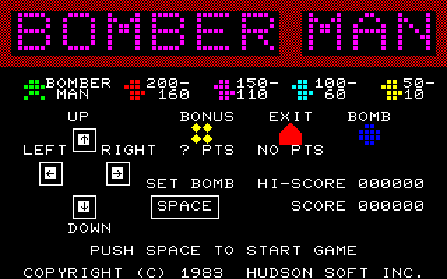
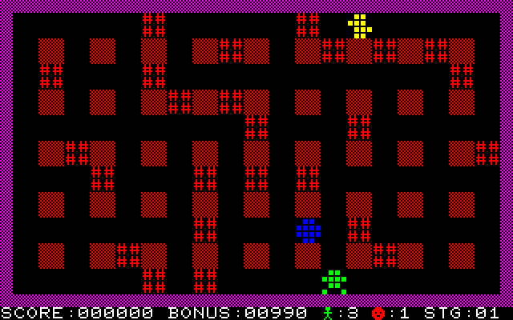
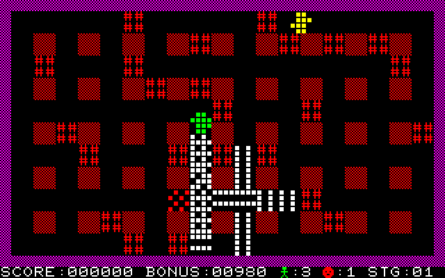

# SAPI-Bomberman

**Bomberman pro Tesla SAPI-1**: port hry Hudson Soft z roku 1983 (verze pro Sharp MZ-700) na sestavu „V“ Libora
Lasoty s barevnou grafikou CGA-1V a zvukovou kartou MPH-1V. Běží pod CP/M jako `BOMBER.COM`, i při procesoru
2 MHz.

> *English: a port of Hudson Soft's Bomberman (1983, Sharp MZ-700 version) to the Czechoslovak Tesla SAPI-1
> computer with Libor Lasota's "V" boards: colour graphics CGA-1V, YM3812 sound and an Atari joystick on MPH-1V,
> CP/M. Runs at 2 MHz too. Tested on a real SAPI-1 and in the SAPIemu emulator. The documentation is in Czech.*

## Stažení

Hotová hra je v [Releases](https://github.com/mlukasek/SAPI-Bomberman/releases):
- `BOMBER.COM` pro CP/M;
- `bomber.hex` (Intel HEX od 0100h) pro nahrání do paměti emulátoru.

Verze 1.0.0, co je nového: [CHANGELOG.md](CHANGELOG.md).

## Co je potřeba

Sestava SAPI-1 „V“ (v emulátoru SAPIemu je to `machines/sapi1v.sapi`):

- procesorová karta **JPR-1V** (Z80, 2 nebo 4 MHz), **RAM-1V** 64 KB s registrem MAP na 63h, **CP/M**;
- barevná grafika **CGA-1V** na C000h při MAP1 = MAP2 = H (`OUT 63h,C0h`);
- zvuková karta **MPH-1V** na 50h (82C54, YM3812), joystick Atari na konektoru K4 (OVL);
- klávesnice **Consul 262.3** (i bez úpravy 7474) nebo **EKL-1**.

Hra je ověřená na skutečném SAPI-1 V i v emulátoru [SAPIemu](https://github.com/mlukasek/SAPIemu) 0.3.0 alpha.

## Spuštění

**V SAPIemu:**
1. Otevřít sestavu `sapi1v.sapi` a při startu zvolit `1` (CP/M z RAM disku A:) nebo `3` (i s IDE diskem
   B:, C:).
2. Na výzvu `A>` nahrát hru: Soubor → Nahrát program do paměti → `bomber.hex`.
3. Uložit ji na disk: `SAVE 42 BOMBER.COM` (nebo `SAVE 42 C:BOMBER.COM` na IDE disk).
4. Spustit: `BOMBER` (nebo `C:BOMBER`).

Pro hru je nejlepší joystick: z gamepadu, nebo z klávesnice PC (Ctrl+F8: šipky a mezerník). Klávesnice SAPI se
volí v menu Stroj → Klávesnice.

**Na skutečném SAPI-1:** přenést `BOMBER.COM` na disk CP/M a spustit `BOMBER`.

## Ovládání

| Akce | Joystick (K4) | Klávesnice Consul 262.3 | Klávesnice EKL-1 |
|---|---|---|---|
| pohyb | páka | šipky | šipky |
| bomba, start hry | palba | mezerník | mezerník |
| konec, návrat do CP/M | | ESC nebo BREAK | ESC |

- Šipkou jeden stisk = jedno políčko. Stisk téže šipky během pohybu přidá další políčko, takže držená šipka
  (autorepeat) dává plynulý pohyb.
- Palba nebo mezerník, kterými se hra spustí, bombu nepoloží. Další stisk už ano.
- S joystickem jde chodit a pokládat bomby zároveň.

**Cíl hry:** bombami zničit všechny nepřátele, pak hra přejde na další stage.
- Pod cihlami je schovaný BONUS (náhodné body) a EXIT (vstup na něj vygeneruje stage znovu).
- Zasáhne-li výbuch bonus nebo východ, objeví se čtyři další nepřátelé.
- Na stage je 1000 jednotek času. Zbylý čas se přičte ke skóre. Po vypršení zmizí všechny cihly i bonus
  a východ.

## Co je jinak než na MZ-700

- **Obraz:** stejné znaky a barvy jako na MZ-700 (dlaždice ze znakového generátoru MZ), na CGA-1V 320×200.
- **Zvuk:** tóny hraje YM3812 (na MZ obdélník z čítače 8253). Výšky odpovídají evropskému MZ-700.
  - Na MZ hra během pípání stála, takže se při výbuchech zpomalovala.
  - Tady tóny hrají vedle hry: snímek má vždy 60,8 ms, i při výbuchu pěti bomb najednou.
- **Rychlost:** pevná, 60,8 ms na snímek. To je rychlost MZ-700 v klidu.
- **Ovládání:**
  - přibyl joystick a s ním pohyb a bomba zároveň (MZ četlo jen jednu klávesu);
  - šipkou jde hráč vždy o celé políčko;
  - ESC (u Consulu i BREAK) vrátí do CP/M.
- **Hra samotná** je stejná: mapy, nepřátelé, body i chyby originálu. Herní kód se nezměnil.

## Pro vývojáře

- Jak je port udělaný (grafika, zvuk, klávesnice, paměť a porty, rychlost): [docs/technika.md](docs/technika.md)
- Překlad, emulátor, ověřování změn, pasti: [docs/vyvoj.md](docs/vyvoj.md)
- Stav a další kroky: [docs/stav.md](docs/stav.md)
- Rozhodnutí a jejich důvody: [docs/rozhodnuti.md](docs/rozhodnuti.md)
- Plán síťové hry: [docs/sitova-hra.md](docs/sitova-hra.md)
- Podrobnosti HW, které zatím nikdo cíleně neměřil: [docs/nejasnosti.md](docs/nejasnosti.md)

Překlad: `build.cmd` (assembler pasmo 0.5.3 a Python 3) → `build\bomber.com`.

## Autoři a práva

- **Hra:** © 1983 Hudson Soft (Bomberman pro Sharp MZ-700).
- **Disassembler originálu** (`orig/bomber.asm`) a páska `orig/bomber.mzf` pocházejí z projektu
  [BomberNet](https://github.com/MZPico/BomberNet), který je také zveřejňuje.
- **Znakový generátor MZ-700** (© Sharp) v repu není. Dlaždice v `sapi/tables.asm` jsou z něj odvozené (jako
  tabulky v BomberNet). Pro jejich nové vygenerování je potřeba vlastní dump `orig/cgrom.bin`.
- **Port na SAPI-1:** Martin Lukášek (mlukasek, 8bity.cz), s pomocí Claude (Anthropic).
- **Desky „V“** (JPR-1V, RAM-1V, CGA-1V, MPH-1V): Libor Lasota.
